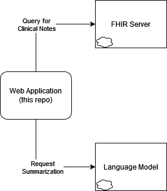

# Technical User Manual

## Starting a Local Instance

1. Install dependencies. 

```bash
npm install
# or
npm ci
``` 
2. In the root of the repo, create a file called `.env`. A sample file can be found below. Make sure to replace `API_KEY` with your own OpenAI API key.

```bash

API_KEY=<OPENAI_API_KEY>
MODEL_VER=gpt-3.5-turbo
ENV=LOCAL

# the variables below are not currently being used, 
# but they must still be present in the file, even if empty
FHIR_U=
FHIR_P=
FHIR_SERVER_URL=
```

3. Start a local development server.

```bash
npm run dev

# or start the server and open the app in a new browser tab
npm run dev -- --open
```

3. Access the running application by visiting `http://localhost:5173/`.


If the application started successfully, you should be greeted by the screen below.


</img>


## How to Use the Application
**NOTE:** since this application is currently loading bundles from local files instead of fetching from a live FHIR server, features like the date range selection currently have no effect.

1. Visit the live application at https://cnotes-84a3dd9afa2f.herokuapp.com/, or the local server at http://localhost:5173/.
2. Select a date range from for which you would like to search clinical notes for.
3. Click on the `Get Clinical Notes` button to retrieve clinical notes.
4. Once the clinical notes have been retrieved, click on the `Summarize` button to generate a summary of the clinical notes.

5. (Optionally) if running locally, you may modify the contents of `bundle.json`, found at the root of this repo, in order to change the input data (the raw, un-summarized notes).


## Technical Description

This web application was originally meant to query an external FHIR server in order to retrieve the clinical notes for a patient for a given date range, but instead it now loads the data from a local JSON file, `bundle.json`.

The pertinent is then extracted from the loaded file, and the clinical notes will be parsed from the DocumentReference 
resources found within the Bundle.

The resulting dataset is then be sent to an external language model for it to be summarized. This process may have to be repeated several times depending on the length of the input data. This is achieved through use of Open AI's ChatGPT API. Finally, the summarized data is displayed to the user.


</img>
<p  style="margin: auto; margin-top: 0; text-align: center;">
    Figure 1: updated architectural diagram.
</p>


</br>
</br>


</img>

<p  style="margin: auto; margin-top: 0; text-align: center;">
    Figure 2: original architectural diagram, as presented in project proposal.
</p>

