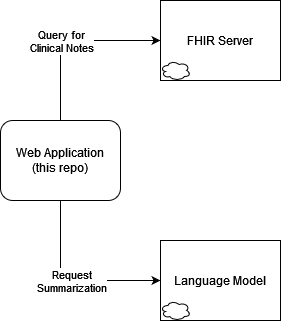

# CS 6440 Practicum Project

## Overview

<p style="width: 60%">
This project will consist of a web application that will allow users to view a textual summary of all the clinical notes generated by their health 
providers within a given date range.
</p>

## Technical Description

<p style="width: 60%">
The web client (this repo) will query an external FHIR server to retrieve all the clinical notes for a patient for a given date range. 
The pertinent data will then be extracted from the resulting server response, and the clinical notes will be parsed from the DocumentReference 
resources found within the response. All this data will then be aggregated. 
</p>

<p style="width: 60%">
The resulting dataset will then be sent to an external language model (specific model/service to be determined) for it to be summarized.
This process may have to be repeated several times depending on the amount of clinical notes received from the FHIR server. Finally, all the summarized data will be displayed to the user.
</p>



</img>


## Glossary

<div style="width: 60%">

- **Clinical Note:** the result of a health provider recording their interactions with a patient. Clinical notes can be "a record of visit, capturing the clinician’s subjective and objective findings, observations, diagnoses and recommended treatment plans" [1].   

  Within FHIR specifically, clinical notes can be one of at least eight different times of common clinical notes, which include consultation, discharge summary, history & physical, procedure, progress, imaging narrative, laboratory report narrative, and pathology report narrative notes [2].

- **FHIR:** The Fast Healthcare Interoperability Resources (FHIR, pronounced "fire") standard is a set of rules and specifications for exchanging electronic health care data [3].

- **DocumentReference:** In FHIR, a reference to a document of any kind for any purpose [4].
</div>

## References
<div style="width: 60%">

1. Understanding clinical notes: https://medium.com/@dothealth/understanding-clinical-notes-d98afeabf90

2. Clinical Notes Guidance: https://hl7.org/fhir/us/core/stu4/clinical-notes-guidance.html

3. Fast Healthcare Interoperability Resources - https://en.wikipedia.org/wiki/Fast_Healthcare_Interoperability_Resources

4. Resource DocumentReference - https://www.hl7.org/fhir/documentreference.html

</div>


## Developing

Once you've created a project and installed dependencies with `npm install` (or `pnpm install` or `yarn`), start a development server:

```bash
npm run dev

# or start the server and open the app in a new browser tab
npm run dev -- --open
```

## Building

To create a production version of your app:

```bash
npm run build
```

You can preview the production build with `npm run preview`.

> To deploy your app, you may need to install an [adapter](https://kit.svelte.dev/docs/adapters) for your target environment.
