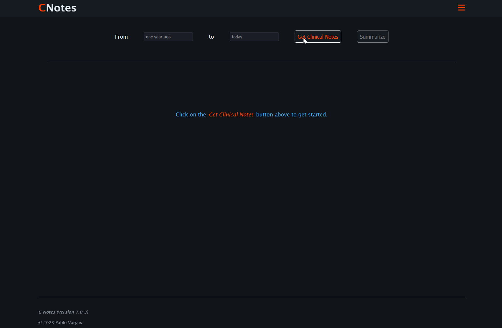

# CNotes


</img>

## Overview

CNotes is a web application that allows users to view a simpler summarized version of their clinical notes data. To use the web app visit ~~https://cnotes-84a3dd9afa2f.herokuapp.com/~~.


This application is built using [SvelteKit](https://kit.svelte.dev/).

**NOTE: this app has been taken down indefinitely.**

## Starting a Local Development Instance

1. Install dependencies.

```bash
npm install
# or
npm ci
``` 
2. In the root of the repo, create a file called `.env`. A sample file can be found below. Make sure to replace `API_KEY` with your own OpenAI API key.

```bash
API_KEY=<OPENAI_API_KEY>
MODEL_VER=gpt-3.5-turbo
ENV=LOCAL
FHIR_SERVER_URL=
```

3. Start a local development server.

```bash
npm run dev

# or start the server and open the app in a new browser tab
npm run dev -- --open
```

3. Access the running application by visiting `http://localhost:5173/`.

## Building a Deployable Version
**Note:** the following steps are not necessary to run a local instance.

1. In the root of the repo, create a file called `.env.prod`. A sample file can be found below.

```bash
API_KEY=<OPENAI_API_KEY>
MODEL_VER=gpt-3.5-turbo
ENV=PROD
FHIR_SERVER_URL="https://sample-url.com/fhir/"
```

2. Create a containerized production version of the app. The production build can be previews with `npm run preview`.

```bash
docker-compose build
```

The command above will result in a Docker image called `cnotes`.

## How to Use the Application

1. Visit the live application at ~~https://cnotes-84a3dd9afa2f.herokuapp.com/~~ (no longer available), or the local server at http://localhost:5173/.
2. Select a date range from for which you would like to search clinical notes for.
3. Click on the `Get Clinical Notes` button to retrieve clinical notes.
4. Once the clinical notes have been retrieved, click on the `Summarize` button to generate a summary of the clinical notes.

## Technical Description

This web application queries an external FHIR server in order to retrieve the clinical notes for a patient for a given date range.

The pertinent data is then extracted from the server response bundle, and the clinical notes are parsed from the DocumentReference 
resources found within the bundle.

The resulting dataset is then be sent to an external language model for it to be summarized. This process may have to be repeated several times depending on the length of the input data. This is achieved through use of Open AI's ChatGPT API using GPT-3.5 model.


</br>
</br>


</img>

<p  style="margin: auto; margin-top: 0; text-align: center;">
    Figure 1: architectural diagram.
</p>


## Glossary

<div style="width: 60%">

- **Clinical Note:** the result of a health provider recording their interactions with a patient. Clinical notes can be "a record of visit, capturing the clinician’s subjective and objective findings, observations, diagnoses and recommended treatment plans" [1].   

  Within FHIR specifically, clinical notes can be one of at least eight different times of common clinical notes, which include consultation, discharge summary, history & physical, procedure, progress, imaging narrative, laboratory report narrative, and pathology report narrative notes [2].

- **FHIR:** The Fast Healthcare Interoperability Resources (FHIR, pronounced "fire") standard is a set of rules and specifications for exchanging electronic health care data [3].

- **DocumentReference:** In FHIR, a reference to a document of any kind for any purpose [4].
</div>

## References
<div style="width: 60%">

1. Understanding clinical notes: https://medium.com/@dothealth/understanding-clinical-notes-d98afeabf90

2. Clinical Notes Guidance: https://hl7.org/fhir/us/core/stu4/clinical-notes-guidance.html

3. Fast Healthcare Interoperability Resources - https://en.wikipedia.org/wiki/Fast_Healthcare_Interoperability_Resources

4. Resource DocumentReference - https://www.hl7.org/fhir/documentreference.html

</div>